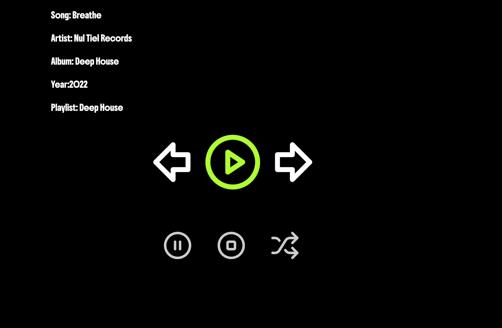

### Getting started

```bash
npm install
npm run dev
```

### Requirements

We'd like to see a working media player that can play through a playlist of audio files (included), display info on the
currently playing track and supporting basic functionality like play/pause, next track, etc. Beyond that, feel free to get
creative with the design and functionality.

Plan on spending 2-4 hours to complete this exercise.

Please update this README to include a screenshot of the completed exercise at the top.

### Playlist data

The playlist data is stored in `src/data/playlists.json`. It includes a list of audio files and some associated metadata,
you can import the json file directly with no need for network requests.

### Attribution

This project includes music from the following albums:

- **"Deep House"** by _Nul Tiel Records_ is licensed under [CC BY-NC-SA 4.0](https://creativecommons.org/licenses/by-nc-sa/4.0/).
- **"Neither and Both"** by _Brylie Christopher Oxley_ is licensed under [CC BY 4.0](https://creativecommons.org/licenses/by/4.0/).
